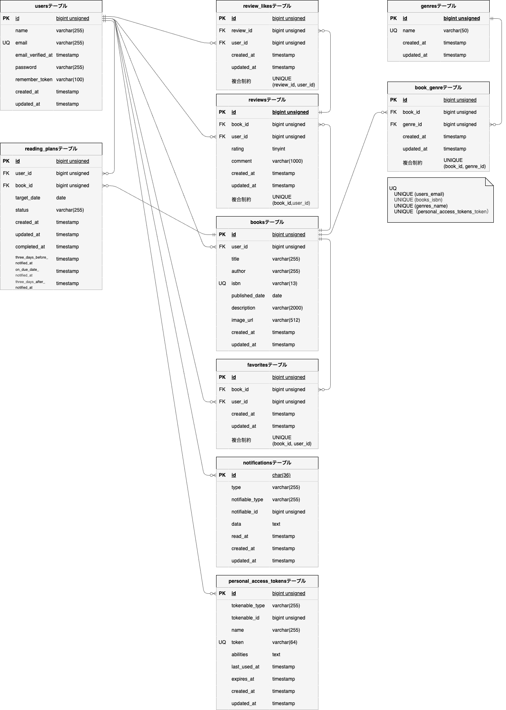

# BookShelf 本レビューアプリ

Laravel 10を使用して開発した本レビューアプリです。

ユーザーは書籍の一覧・詳細・ランキングを閲覧でき、ログイン後は書籍登録、レビュー投稿、お気に入り登録、レビューいいね、ジャンル管理、読書計画、マイ読書レポート、通知確認を行うことができます。

また、書籍情報を扱うREST APIを提供しており、書籍データの一覧取得・詳細取得・登録・更新・削除に対応しています。APIの書き込み系処理ではLaravel Sanctumによる認証を行い、更新・削除ではPolicyによる所有者確認を行います。

---

# 主な機能

## ゲストユーザー

- 書籍一覧表示
- キーワード検索
- ジャンル絞り込み
- 並び替え
- 書籍詳細表示
- 評価ランキング表示
- 会員登録
- ログイン

## 認証済みユーザー

- ログアウト
- 書籍登録
- ISBN検索による書籍情報取得
- 書籍編集
- 書籍削除
- レビュー投稿
- レビュー編集
- レビュー削除
- お気に入り一覧表示
- お気に入り登録・解除
- レビューいいね登録・解除
- ジャンル一覧表示
- ジャンル詳細表示
- ジャンル登録
- ジャンル編集
- ジャンル削除
- マイ読書レポート表示
- 読書計画一覧表示
- 読書計画登録
- 読書計画編集
- 読書計画削除
- 読書計画の読了状態への変更
- 通知一覧表示
- 通知の既読処理

## 通知・バッチ処理

- 読書計画の期日3日前通知
- 読書計画の期日当日通知
- 読書計画の期日3日後通知
- 期限を過ぎた読書計画の期限超過ステータス更新
- Schedulerによる日次バッチ実行

## API

- 書籍一覧取得
- 書籍詳細取得
- 書籍登録
- 書籍更新
- 書籍削除
- SanctumによるAPI認証
- PolicyによるAPI更新・削除の所有者認可

---

# ER図

-

## リレーション

- User : Book = 1 : N
- User : Review = 1 : N
- Book : Review = 1 : N
- Book : Genre = N : N
- Book : book_genre = 1 : N
- Genre : book_genre = 1 : N
- User : Book = N : N（favorites）
- User : Favorite = 1 : N
- Book : Favorite = 1 : N
- Review : User = N : N（review_likes）
- Review : ReviewLike = 1 : N
- User : ReviewLike = 1 : N
- User : ReadingPlan = 1 : N
- Book : ReadingPlan = 1 : N
- User : Notification = 1 : N（Polymorphic）
- User : PersonalAccessToken = 1 : N（Polymorphic）

---

# 使用技術

| 項目 | 技術 |
|------|------|
| PHP | 8.1以上 |
| Laravel | 10.x |
| データベース | MySQL 8.4 |
| フロントエンド | Vite 5 |
| CSSフレームワーク | Tailwind CSS 3.4 |
| JavaScript | Alpine.js |
| 認証 | Laravel Fortify |
| API認証基盤 | Laravel Sanctum |
| 外部API | Google Books API |
| バッチ処理 | Laravel Scheduler |
| テスト | PHPUnit |
| コード整形 | Laravel Pint |
| 開発環境 | Docker |
| コンテナ管理 | Laravel Sail |
| DB管理 | phpMyAdmin |
| バージョン管理 | Git / GitHub |

---

# APIエンドポイント一覧

## 書籍API

| Method | URI | Controller | Action | Route Name | 認証 | 認可 |
|---|---|---|---|---|---|---|
| GET | /api/v1/books | Api\V1\BookController | index | api.v1.books.index | 不要 | 不要 |
| GET | /api/v1/books/{book} | Api\V1\BookController | show | api.v1.books.show | 不要 | 不要 |
| POST | /api/v1/books | Api\V1\BookController | store | api.v1.books.store | 必要 | 不要 |
| PUT | /api/v1/books/{book} | Api\V1\BookController | update | api.v1.books.update | 必要 | can:update,book |
| DELETE | /api/v1/books/{book} | Api\V1\BookController | destroy | api.v1.books.destroy | 必要 | can:delete,book |

## 書籍一覧APIの検索条件

| Query | 内容 |
|---|---|
| keyword | タイトル・著者名検索 |
| genre | ジャンルIDによる絞り込み |
| sort | newest / oldest / rating / title |
| page | ページ番号 |
| per_page | 1ページあたりの取得件数 |

## API認証

書籍登録・更新・削除APIでは、SanctumのBearer Tokenを使用します。

```text
Authorization: Bearer {token}
```

書籍登録APIでは、リクエストの`user_id`ではなく、認証ユーザーのIDを登録者として使用します。

---

# 設計書

- [Route設計書](docs/route-design.md)
- [ER図](docs/er.drawio)
- [画面遷移図](docs/screen-flow.drawio)

---

# 環境構築

## リポジトリをクローン

```bash
git clone https://github.com/taiga-kawakubo/bookshelf-app.git
cd bookshelf-app
```

## 環境変数ファイルを作成

```bash
cp .env.example .env
```

## データベース設定

`.env` のデータベース設定を以下のように設定します。

```env
DB_CONNECTION=mysql
DB_HOST=mysql
DB_PORT=3306
DB_DATABASE=laravel
DB_USERNAME=sail
DB_PASSWORD=password
```

## Google Books API設定

ISBN検索機能でGoogle Books APIを利用します。必要に応じて、`.env` に以下を設定します。

```env
GOOGLE_BOOKS_API_KEY=
GOOGLE_BOOKS_API_URL=https://www.googleapis.com/books/v1/volumes
```

## Composer依存関係をインストール

ローカル環境にComposerが入っていない場合でも、Dockerを使って依存関係をインストールできます。

```bash
docker run --rm \
  -u "$(id -u):$(id -g)" \
  -v "$(pwd):/var/www/html" \
  -w /var/www/html \
  laravelsail/php82-composer:latest \
  composer install --ignore-platform-reqs
```

ローカル環境にComposerが入っている場合は、以下でも実行できます。

```bash
composer install
```

## Sailコンテナ起動

```bash
./vendor/bin/sail up -d
```

エイリアス設定済みの場合は、以下でも実行できます。

```bash
sail up -d
```

## アプリケーションキー生成

```bash
./vendor/bin/sail artisan key:generate
```

エイリアス設定済みの場合は、以下でも実行できます。

```bash
sail artisan key:generate
```

## マイグレーション・シーディング実行

```bash
./vendor/bin/sail artisan migrate:fresh --seed
```

エイリアス設定済みの場合は、以下でも実行できます。

```bash
sail artisan migrate:fresh --seed
```

## フロントエンド依存関係インストール

```bash
./vendor/bin/sail npm install
```

エイリアス設定済みの場合は、以下でも実行できます。

```bash
sail npm install
```

## Vite起動

```bash
./vendor/bin/sail npm run dev
```

エイリアス設定済みの場合は、以下でも実行できます。

```bash
sail npm run dev
```

※ このコマンドは実行中のままにしておく必要があります。
そのため、以降のコマンド操作を行う場合は、別のターミナルタブを開いて実行してください。

---

# 開発環境URL

## アプリケーション

```text
http://localhost/books
```

## phpMyAdmin

```text
http://localhost:8080
```

---

# 初期ログイン情報

シーディング実行後、以下のユーザーでログインできます。

| 項目 | 内容 |
|------|------|
| メールアドレス | yamada@example.com |
| パスワード | password |

その他、以下のユーザーも同じパスワードで作成されます。

- suzuki@example.com
- tanaka@example.com
- sato@example.com
- takahashi@example.com

---

# バッチ処理

読書計画に関する日次バッチは、Laravel Schedulerで実行します。

| コマンド | 実行タイミング | 内容 |
|---|---|---|
| app:update-overdue-reading-plans | 毎日0:00 | 期日を過ぎた進行中の読書計画を期限超過に更新 |
| app:send-reading-plan-reminders | 毎日20:00 | 読書計画の期日に応じた通知を作成 |

手動で確認する場合は、以下のコマンドを使用します。

```bash
sail artisan app:update-overdue-reading-plans
```

```bash
sail artisan app:send-reading-plan-reminders
```

Schedulerを手動実行する場合は、以下を使用します。

```bash
sail artisan schedule:run
```

---

# テスト実行方法

LaravelのFeatureテスト・Unitテストは以下のコマンドで実行できます。

```bash
sail artisan test
```

Sailのエイリアスを設定していない場合は、以下のコマンドを使用してください。

```bash
./vendor/bin/sail artisan test
```

特定のテストのみ実行する場合は、以下のように指定します。

```bash
sail artisan test --filter=RegistrationTest
```

Sailのエイリアスを設定していない場合は、以下のコマンドを使用してください。

```bash
./vendor/bin/sail artisan test --filter=RegistrationTest
```

---

# テストカバレッジ確認方法（任意）

テストカバレッジは以下のコマンドで確認できます。

```bash
sail artisan test --coverage
```

Sailのエイリアスを設定していない場合は、以下のコマンドを使用してください。

```bash
./vendor/bin/sail artisan test --coverage
```


本アプリケーションでは、Controller・FormRequest・Resource・Modelを中心にテストを作成しています。

主なテスト対象は以下です。

- 会員登録
- ログイン・ログアウト
- 公開ページアクセス
- 書籍一覧・詳細・登録・編集・更新・削除
- 書籍検索・ジャンル絞り込み・並び替え
- レビュー投稿・編集・更新・削除
- お気に入り登録・解除
- レビューいいね登録・解除
- ジャンル一覧・詳細・登録・編集・更新・削除
- ランキング表示
- ISBN検索
- マイ読書レポート
- 読書計画
- 通知機能
- 日次バッチ処理
- APIによる書籍一覧取得・詳細取得・登録・更新・削除
- API認証・認可
- FormRequestのバリデーション
- API Resourceのレスポンス形式

---

# コード整形確認

Laravel Pintによるコード整形は以下のコマンドで実行できます。

```bash
sail pint
```

Sailのエイリアスを設定していない場合は、以下のコマンドを使用してください。

```bash
./vendor/bin/sail pint
```

整形が必要なファイルがないか確認する場合は、以下を実行します。

```bash
sail pint --test
```

Sailのエイリアスを設定していない場合は、以下のコマンドを使用してください。

```bash
./vendor/bin/sail pint --test
```

---

# ディレクトリ構成

```text
docs/
├── er.drawio
├── route-design.md
└── screen-flow.drawio

app/
├── Actions/
├── Console/
├── Enums/
├── Http/
├── Models/
├── Notifications/
├── Policies/
└── Providers/

database/
├── factories/
├── migrations/
└── seeders/

resources/
├── css/
├── js/
└── views/

routes/
├── api.php
└── web.php

tests/
├── Feature/
└── Unit/
```

---

# 作成者

川久保　大河
